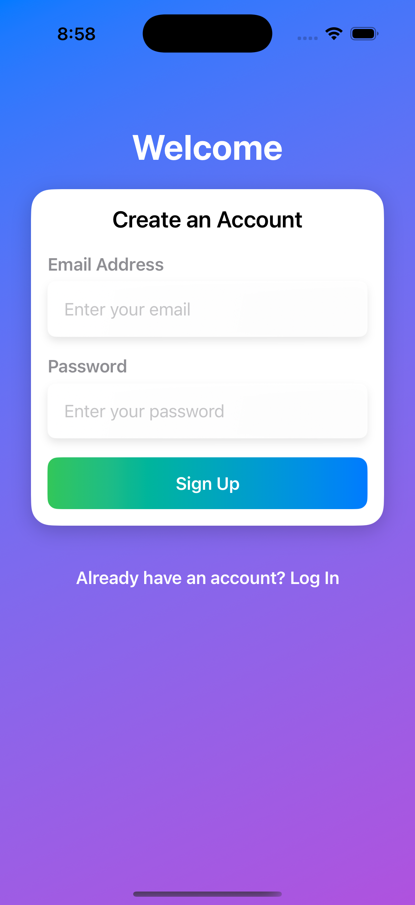
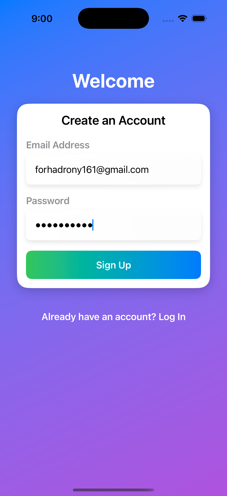
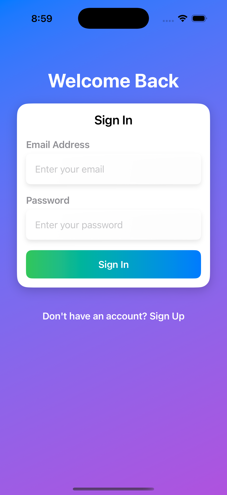
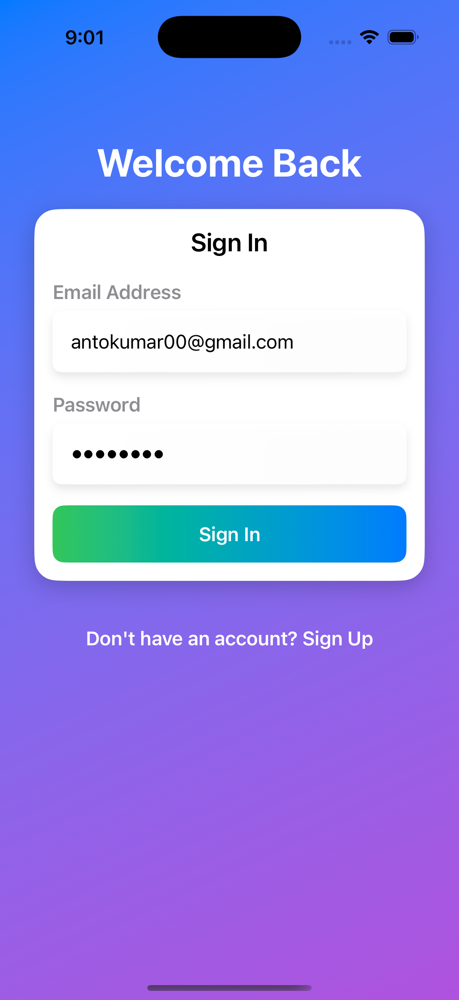
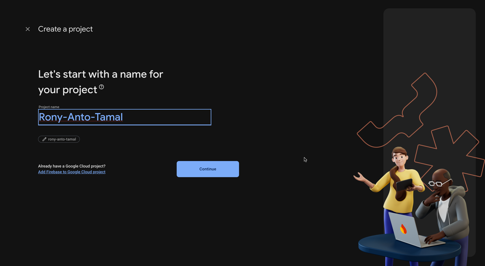
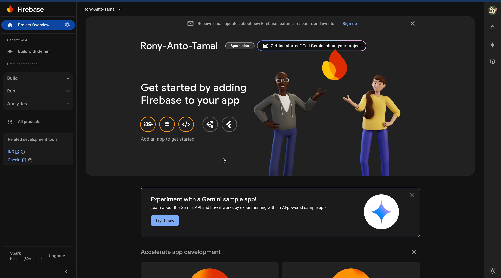

# iOS Assignment
# Simple Login Registration App

This app was developed by:  
1. **Forhad Islam Rony** (2007065)  
2. **Anto Kumar Paul** (2007066)  
3. **Tamal Priyo Chakraborty** (2007067)  

## Screenshots  

  <!-- Image 1 -->
  

    
<strong>SignUp Created By Forhad Islam Rony</strong> (2007065)

    
    
  

   

  <!-- Image 2 -->
  

    
<strong>SignIn Created By Anto Kumar Paul</strong> (2007066)

    
      
  

   
  <!-- Image 3 -->
  

    
<strong>Firebase Created By Tamal Priyo Chakraborty</strong> (2007067)

    
    
  

   

